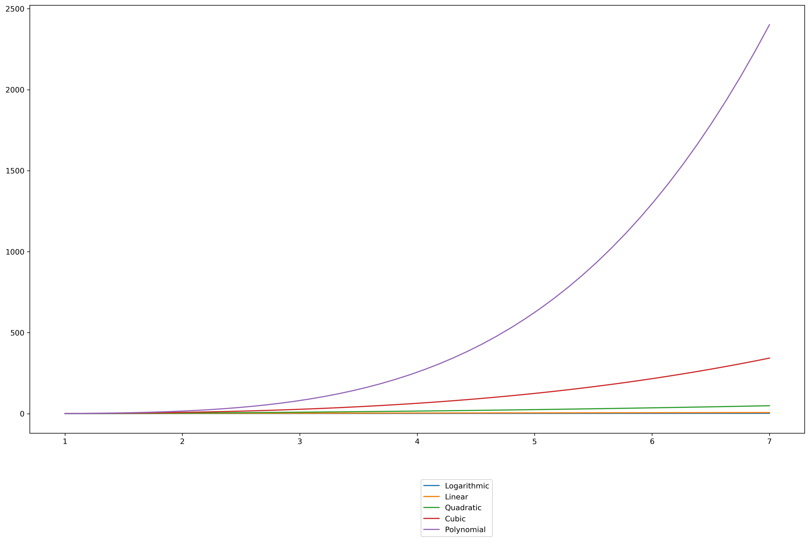

# Introduction
Computational complexity has always been a matter of concern when designing alogrithms. As we always want the algorithm to work as fast as possible thus requiring lesser time to execute. Here, we are going to see the bhevioural difference between few time complexity equations of few algorithms. 

The task we are performing here is determining the best performing algorithm using visualization. The choice of language will be python as this language enables easy access to such libraries which can help perform visualizations. The visualizations have been done using the `matplotlib.pyplot` library. The equations have been formed using `numpy` or `Numerical Python` lilbrary.

# Language
- Python

# Libraries
- Matplotlib.pyplot
- Numpy

# Data
The data that will be used in this task will come directly from the user. The input range is flexible and can be set from 1 to positive infinity.

# Methodoloy
The procedure which is being followed here is defining a function and taking the number of points from the user as `n` and for the n^k equation taking `k` as input from the user. The logarithmic equation has been established using the `numpy` library. The resulting function will produce a plot which will have all the graphs generated from the equations and will show the indecating colour of each plot using legend. From the graph the user will be able to determine which function will provide the best results.

# Graph
 
# Conclusion
